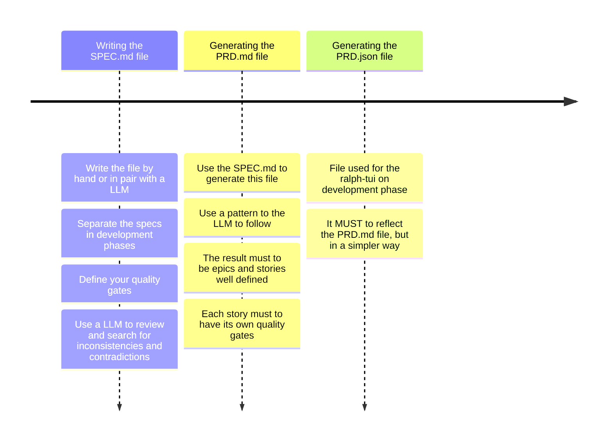
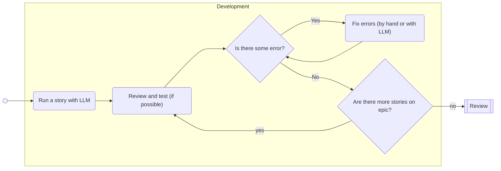
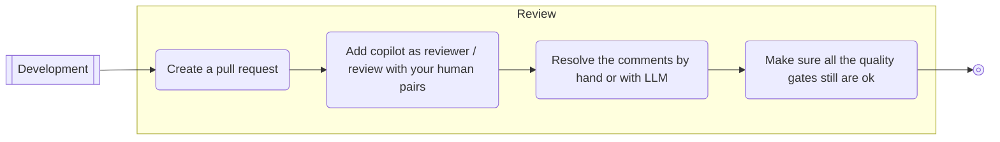
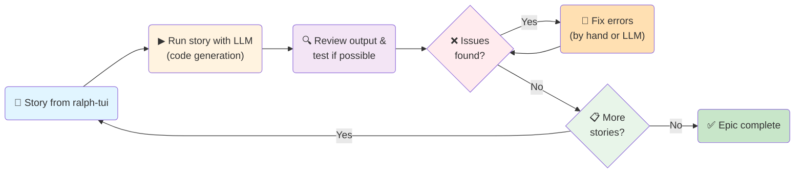

# Light SDD Workflow

## Main phases
### SPEC Phase (AKA upstream)
This phase reflects the upstream phase on an agile flow. It will start with your specifications and will to finish with epics and stories ready to run. Use a small LLM good to process and organize text.

#### Writing the SPEC.md file
Define the business rules and architecture here, never delegate these decisions to the LLM. If you need to do a pair with it, review EVERYTHING.

These definitions doesn't need to be long or complex, but it need to describe the system. Consider to use mermaid notation diagrams to give more details to the LLM on the next steps (specially about the business core).

You can use flowcharts for complex chunks of logic, sequence diagrams for complex communications, timeline diagrams for rules that must happen in a specific order or state machine diagrams if your system has that type of complexity.

> Separating the specs as epics in development phases will make things easer on the later steps.

> Define all your quality gates here.

> Consider to use a LLM to review and check for inconsistencies and contradictions on your specs.

#### Generating the PRD.md file
Use the previous written SPECS to generate this file. Indicate a pattern to the LLM to follow. I use the ralph-tui pattern, for example, but you can use any you prefer. More of it on later sessions.

This file must to have all the given specs separated in epics and user stories. If you separated your specs in development phases, this should be reflected here. The user stories must to be small and easy to review. Each story must to have its own quality gates.

> Prefer to have a archirecture story at the end of every epic, for updating your README and ARCHITECTURE files.

> Review the file and agree with it before the next step.

#### Generating the PRD.json file
This is the json file actually readen by the ralph-tui application. It should have all the epics and stories defined in a simple way, with all steps to take and quality gates. It MUST to reflect the PRD.md file.

> Review the file and agree with it before the next step.

### Development phase (AKA downstream)
#### Developement

This is the moment where you assist the LLM to run all the plan prepared on SPEC phase. If you are using the ralph-tui application, you can run the commnad `ralph-tui run --prd prd.json` for starting the ui.

You can run all the stories automatically and test only in the end, but this has a potential to take more time than save it. Just prefer to run one small story by time and review / test when possible.

Create a script that runs build/lint/security/scan/automated tests at once. Then, you will need to run only one command to test the project integrity after running a story. If possible, test manually too. **Be sure your product works**.

If some fix be necessary, you can fixit or ask a LLM to fix for you. Again, small LLMs are doing a great job on this minor fixes and refactor to me.

Repeat this proccess until all stories be finished.

#### Review

There's no much to say about the review phase. Just create your pull request as you always done. But, if you use github, you can ask copilot to review the code for you. Ask your pairs to review it too, **humans are not obsolete**.

If copilot return something relevant, you can solve it or ask a small LLM to solve for you. Again, be sure about your project integrity, run all your checks after each change and test manually if possible.

Now your ready to restart the cycle on the next epic.

## Epic workflows

### AllIn Workflow
This workflow is ideal when you have a clear vision of the entire system from the start. You begin by writing the specifications for all your epics at once (`specPhaseComplete`, step 1). Then, for each epic, you create a separate branch and develop it independently (`oneEpicByTime`, step 2). Within each epic, you work through the stories one by one (`oneStoryByTime`, step 3), iterating on them until the epic is complete. After finishing an epic, you move on to the next, repeating the process. This approach is structured and works well for greenfield projects or when requirements are stable and well-understood.

### AgileSdd Workflow
This workflow is more incremental and adaptive, suitable for projects where requirements may evolve or are not fully known upfront. Here, you write the specification for one epic at a time (`specPhaseOnyEpicByTime`, step 1). You then develop that epic (`developEpic`, step 2), working through its stories individually (`developStory`, step 3). After completing a story, you can either continue with the next story or revisit the epic for adjustments. Once the epic is done, you return to the specification phase for the next epic. This cycle allows for continuous feedback and adaptation, making it ideal for agile teams and projects with changing needs.

## Notes
### What is ralph loop and the ralph-tui and why use it
The **ralph-tui** is a task orchestration and execution tool designed for the Development phase of the Light SDD Workflow. It reads your `prd.json` file (the JSON representation of your Product Requirements Document) and provides an interactive UI for running and tracking user stories one at a time. You invoke it with `ralph-tui run --prd prd.json`, which loads all your defined stories and guides you through their execution with built-in progress tracking. This tool is what makes the Development phase practical—it eliminates manual bookkeeping of which stories are done, in-progress, or blocked.

The **ralph loop** is the iterative development cycle that ralph-tui facilitates: **run story → review and test → detect errors → fix errors → repeat**. Rather than running all stories at once and testing at the end (which leads to discovering many bugs simultaneously and delays feedback), the ralph loop emphasizes incremental execution. After each story completes, you immediately review, test, and fix issues before moving to the next story. This approach catches errors early when they're fresh in context, reduces integration surprises, and keeps the codebase in a testable state throughout development.

Why use this? Because **integration and testing frequency dramatically reduces risk and effort**. Developers using the ralph loop catch semantic conflicts (where code compiles but doesn't work logically) immediately after a story completes, not weeks later during final integration. This short feedback loop means less rework, clearer error context, and—critically—keeps both the codebase and your confidence in code quality high throughout development.

### The importance of automated tests and security scans
Automated tests and security scans are the foundation of maintaining quality gates throughout the Light SDD Workflow. Every story completion should trigger a consistent, automated verification: **does the code build? Do tests pass? Are there security vulnerabilities?** This prevents the workflow's biggest risk: shipping broken or insecure code because defects weren't caught early.

In Light SDD, create a single script (e.g., `test.sh` or equivalent) that chains together: linting, build compilation, unit tests, integration tests, and security scanning. You can use libs/applications like `mocha` for testing and `opensecurity/njsscan` for SAST (Static Application Security Testing), so your script might run `mocha test/**/*.js` followed by `njsscan --output json .` to catch logic errors and security flaws in one pass. After completing each story with the ralph loop, is a good practice to run this single command once—if it passes, you know the story is solid (and never forget about the linter and its importance to maintain a pattern in the written code); if it fails, you fix it immediately with fresh context. This is far more efficient than discovering dozens of test failures after all stories complete.

The specific types of checks matter: **unit tests** verify individual functions work correctly, **integration tests** confirm different components work together, and **security scans** detect patterns like hardcoded secrets, injection vulnerabilities, or dependency risks before code reaches production. By placing these in an automated script run after each story, you align your development practice with the workflow's core principle—continuous verification and early error detection. Documentation of your automated test approach should be in your ARCHITECTURE file so future developers understand the testing strategy.

### Green fields vs brown fields
**Greenfield** development means building a new system from scratch—you have no existing codebase to work with, requirements are typically well-defined upfront, and you can architect systems optimally from the beginning. Greenfield projects are ideal for the **AllIn workflow** in Light SDD: write specifications for all epics first, then develop them in sequence. There are no legacy constraints, no existing code to understand, and no integration points with mature systems. Examples: building a new microservice, a new product line, or a complete rewrite of a system.

**Brownfield** development means working within an existing system—you inherit legacy code, architectural decisions you didn't make, and constraints from production systems. Brownfield projects benefit from the **AgileSDD workflow**: write specifications one epic at a time, develop and deliver each epic, then repeat. Why? Because existing systems often have hidden requirements that only surface once you start working in them. By cycling through spec → development → delivery one epic at a time, you discover these constraints early and adapt your approach incrementally rather than midway through a months-long development cycle. Examples: adding features to a mature application, maintaining legacy systems, or integrating with existing infrastructure.

The Light SDD Workflow structure (with AllIn and AgileSDD variants) explicitly acknowledges this distinction because greenfield and brownfield have fundamentally different risk profiles. Greenfield risk is *completeness and architectural correctness*—did you design the system right? Brownfield risk is *integration safety and unforeseen constraints*—does your new code break existing functionality? By choosing the workflow that matches your context, you address the right risks at the right time.

### The importance of README and ARCHITECTURE files on AI written projects
When using AI assistance in development, documentation becomes your **bridge of understanding**—both for the LLM and for future developers. A README that explains "what this system does and why" and an ARCHITECTURE file that captures "how it's built and why we chose this design" are not optional polish; they're essential inputs for effective AI collaboration.

LLMs work best with clear context. When you ask an LLM to implement a story, it needs to understand your system's design patterns, business rules, and data flow. Without this, LLMs generate code that might work technically but violates your system's conventions, duplicates logic, or creates hidden bugs. A well-maintained ARCHITECTURE file describing your core patterns, data structures, and key decisions provides the grounding LLMs need to generate coherent, consistent code. Your Light SDD workflow's emphasis on including an **"architecture story" at the end of each epic**—dedicated to updating README and ARCHITECTURE files—reflects this necessity: after each epic, you capture what you've learned about the system's design, making that knowledge available for the next epic's LLM assistance.

Documentation also protects you from vendor lock-in or LLM dependency. Six months from now, if you need to refactor or extend code, a well-documented ARCHITECTURE file lets you (or another developer) understand intent without reconstructing it from code alone. For AI-written projects especially, this documentation is your insurance: it ensures knowledge survives beyond the LLM session and remains accessible to humans.

## Resources
- [Martin Fowler - Patterns for Managing Source Code Branches](https://martinfowler.com/articles/branching-patterns.html) — Comprehensive article on greenfield vs brownfield development contexts, branching strategies, and integration patterns in software development
- [Continuous Integration Best Practices](https://martinfowler.com/articles/continuousIntegration.html) — Martin Fowler's guide on high-frequency integration, testing strategies, and maintaining code quality through automation
- [Mocha Testing Framework](https://mochajs.org/) — JavaScript test framework used in this project for unit and integration testing
- [NJSScan by OpenSecurity](https://github.com/ajinabraham/njsscan) — Static security scanner for Node.js applications, detects security vulnerabilities and code quality issues
