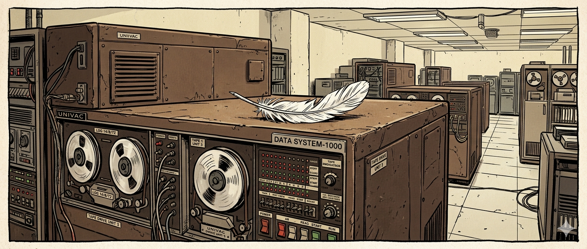
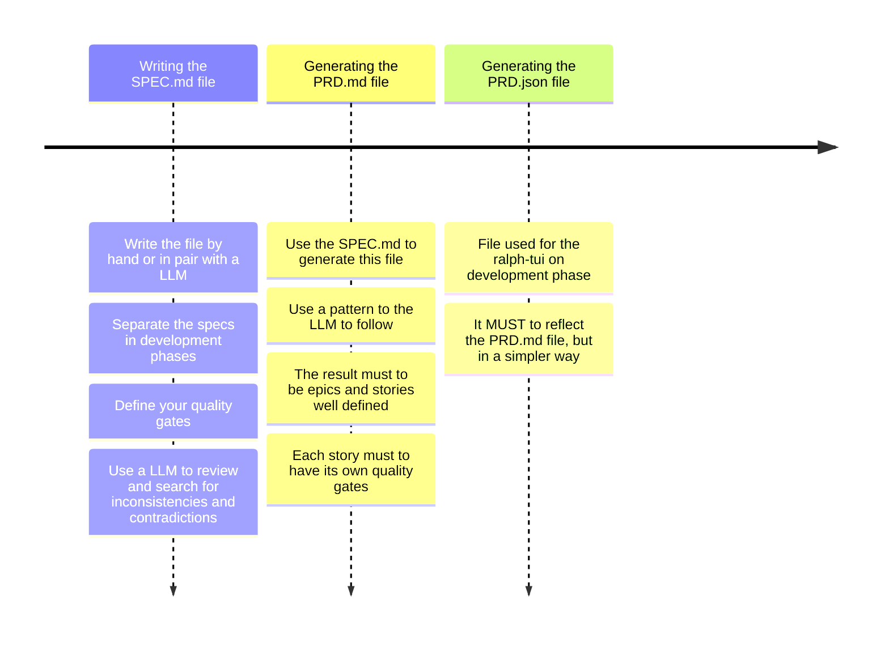
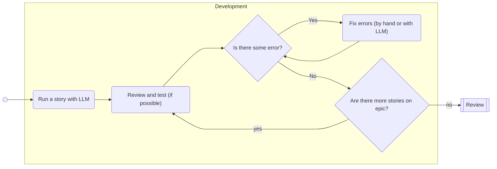
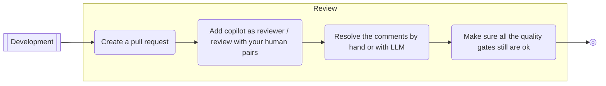
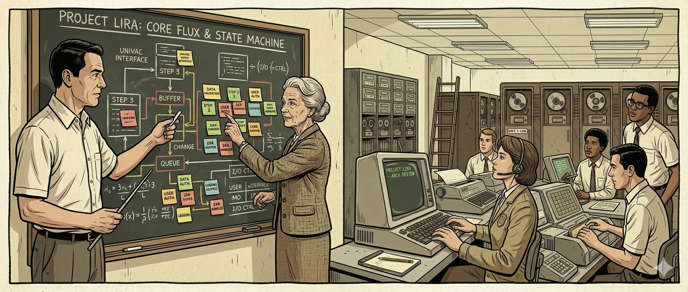
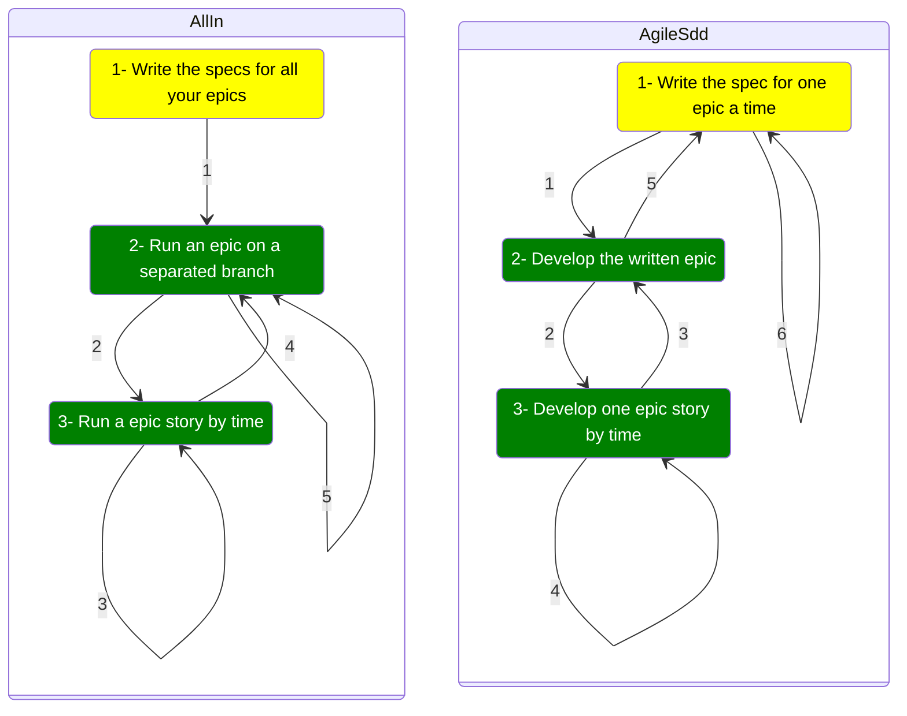
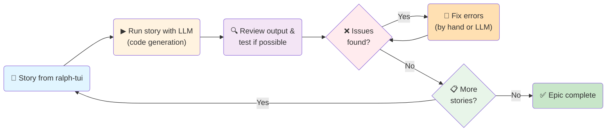
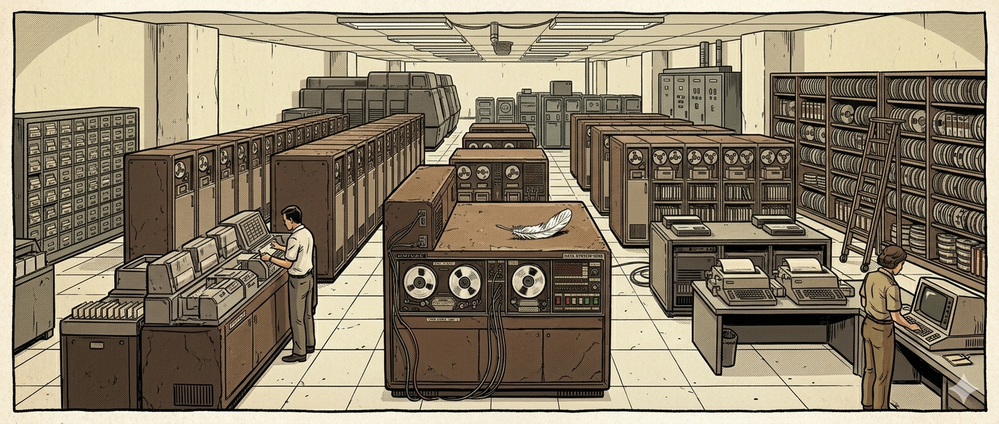

# Light SDD Workflow

## What Is Light SDD Workflow?
**Light SDD Workflow** is a lightweight, language-agnostic methodology for building software with LLM assistance, where humans own critical business logic and architecture decisions, and AI agents accelerate code execution. Written on **April 24, 2026**, this workflow acknowledges a critical reality: the AI landscape evolves faster than any single tool or framework. Light SDD is designed to be adaptable, tool-independent, and future-proof.

### A Path to Follow, Not a Law
This workflow provides **prescribed guidance** for how to structure specifications, execute stories, and maintain quality—but it is **not dogmatic**. Your team may find better approaches for your specific context. Adapt the principles to your needs: your ARCHITECTURE file, your quality gates, your branching strategy, your review process. The core structure (SPEC Phase → Development Phase → agent execution → human review) is proven to catch issues early and keep humans in control.

### Lighter Than Ready Solutions
Unlike heavyweight frameworks (SAFe, Disciplined Agile, etc.), Light SDD is:
- **Minimal ceremony**: No prescribed daily standups, burndown charts, or role explosion for small teams
- **Focused on essentials**: Specifications, epics, stories, quality gates, and human review—nothing more
- **Clear responsibility division**: Humans make critical decisions (business logic, architecture, quality); agents accelerate execution (code generation, testing)
- **Uncompromising on quality**: Lightweight process, rigorous quality gates—you choose the balance

### Language & Framework Agnostic—Works Anywhere
This workflow works with **any programming language** (Python, JavaScript, Go, Rust, Java, C#, etc.) and **any framework** (React, Django, Spring Boot, FastAPI, Next.js, etc.). Adapt your tools to fit:
- **Test frameworks**: Mocha for Node.js, pytest for Python, testing.T for Go, cargo test for Rust
- **Security scanning**: njsscan for Node.js, bandit for Python, gosec for Go, cargo audit for Rust
- **Build and CI/CD**: Your preferred pipeline (GitHub Actions, GitLab CI, Jenkins, etc.)

The **core workflow is language-independent**: Write SPEC.md → Generate PRD.md/PRD.json → Execute stories → Review and validate. The tools change; the methodology remains.

### Tool-Agnostic by Design—AI Models Will Change
Here's a crucial insight written on **April 24, 2026**: The AI landscape moves at unprecedented speed. **Ralph-tui v0.11.0** is mentioned throughout this workflow as the recommended execution tool. But ralph-tui is **only one component**—the Development Phase execution orchestrator. **Ralph-tui can be replaced** with any comparable agent orchestrator. Note: Ralph-tui versions may change; the methodology remains the same regardless of the execution tool version.

**All other workflow phases work with any capable, lightweight LLM**:
- **SPEC Phase**: Write specifications using any LLM (Claude Haiku 3.5, Gemini, Llama, Grok, or whatever emerges next month). The LLM is a tool to review your specs for inconsistencies and help structure your documentation—not to own the business logic.
- **PRD Generation**: Use any LLM to transform SPEC.md into PRD.md and PRD.json. The methodology remains; the model changes.
- **Story Review & Quality Analysis**: Use any LLM to analyze PRD completeness and consistency.
- **Development Phase Execution**: Ralph-tui is *recommended*, but you could use Cursor, Continue.dev, a custom agent loop, VS Code's GitHub Copilot with a script, or whatever execution tool emerges. The pattern is universal: agent generates code → human reviews → quality gates validate → human decides next action.
- **Code Review & Analysis**: Use any LLM (like Claude Haiku 3.5, fast and cost-effective) to review pull requests, suggest improvements, or analyze code patterns.

**Example using Claude Haiku 3.5 (as of April 24, 2026)**: You can run your entire SPEC Phase, PRD generation, and code review using Claude Haiku 3.5 (fast, inexpensive, capable for text analysis). Ask Haiku to review your specifications for contradictions, help structure business rules, validate your PRD against SPEC, and review PRs. In two weeks or two months, a faster, cheaper, or more capable model might emerge—Haiku 4.5, or something new entirely. With Light SDD, you simply *switch the model*. Your workflow doesn't depend on any single LLM or tool.

### Keeps Humans in Control—Leverages Agents Correctly
The fundamental principle: **Agents accelerate, humans decide**.
- **Humans decide**: Business rules, system architecture, quality gates, acceptance of generated code, trade-offs between speed and quality, what gets prioritized next
- **Agents assist**: Code generation, pattern detection, consistency checking, test writing, refactoring suggestions, code review comments, specification review
- **Humans validate**: Every story output is reviewed, tested (both automated and manual), and verified against acceptance criteria before acceptance

This division prevents the biggest risk in LLM-assisted development: **drifting into a state where agents make architectural or business decisions**. Light SDD prevents this through mandatory human review, quality gates, and explicit documentation of why decisions were made (via your ARCHITECTURE file).

---

## Table of Contents

- [Workflow phases](#workflow-phases) — Light SDD Workflow has two main phases: **SPEC Phase (upstream)** where humans own business logic and define specifications, and **Development Phase (downstream)** where autonomous agents execute stories with human review and validation. Together they create a disciplined, specification-driven development cycle.

- [Agile Methodologies on Light SDD Workflow](#agile-methodologies-on-light-sdd-workflow) — Two execution patterns for different contexts: **AllIn workflow** anticipates full architecture upfront (greenfield, clear requirements), while **AgileSDD workflow** iterates with feedback-driven adaptation (brownfield, evolving requirements). Choose based on your risk profile and project context; hybrid approaches combine both strategies.

- [Key Notes](#key-notes) — Key concept deep-dives: understand why ralph-tui's autonomous loop and immediate feedback prevent integration disasters, why automated tests secure quality gates after each story, how greenfield vs brownfield contexts drive workflow choice, and why README/ARCHITECTURE documentation is critical for LLM-assisted development.

- [Resources](#resources) — Curated external references organized by topic: specification standards, epic and agile methodologies, development tools and ralph-tui operations, and testing and security scanning best practices. Each link includes context on how it relates to Light SDD Workflow.

- [Research References](#research-references) — Foundational research files documenting the intellectual foundations and competing methodologies informing Light SDD Workflow design. Includes the Ralph loop concept evolution, Specification-Driven Development research, and comparative analysis of automation approaches.

- [Developers](#developers) — Contributors and maintainers of the Light SDD Workflow project.

## Workflow phases

### SPEC Phase (AKA upstream)
This phase reflects the upstream phase on an agile flow. It will start with your specifications and will finish with epics and stories ready to run. Use a small LLM optimized for text processing and organization, but **keep humans in control of all business logic and architecture decisions**. The SPEC phase is where you capture what the system *must* do and *why*, establishing the foundation for all downstream work.

#### Writing the SPEC.md file

Your SPEC.md file is the **contract between stakeholders and your development team**. It defines business rules, system architecture, quality gates, and constraints—the critical decisions that humans must own and verify, never delegate entirely to LLMs. Think of it as a conversation with your team that answers: "What problem are we solving? What are the system's boundaries? What must never break?"

A good specification is **complete, consistent, unambiguous, and verifiable**. Write requirements using imperative language ("the system **shall** process payments within 5 seconds") rather than soft language ("the system should be fast"). Avoid superlatives, subjective phrases, or vague terms like "user-friendly" or "as needed"—these invite interpretation and later disputes about whether requirements are met. Instead, be measurable: "display results in under 2 seconds" vs "display results quickly."

Structure your SPEC.md with sections for:
- **Purpose & Overview** — What problem does this system solve? Who uses it?
- **Business Rules** — Policies, constraints, workflows that govern behavior (especially important for LLMs to understand later)
- **System Architecture** — High-level design, key components, data flow (use mermaid diagrams for flowcharts, sequence diagrams, state machines for complex logic)
- **Quality Gates** — What does "done" mean? Define acceptance criteria, performance targets, security requirements, testing approach *upfront*
- **Assumptions & Constraints** — What are we NOT building? What dependencies exist?

Use diagrams liberally. Flowcharts clarify complex business logic, sequence diagrams show interactions between components, state machines capture transitions (e.g., order states: pending → confirmed → shipped → delivered). These visual specifications are invaluable for LLMs—they provide concrete examples of what "correct" behavior looks like.

**Separate your specs by development phases/epics early**. If you're building an e-commerce system, grouping specs as "Auth & User Management," "Product Catalog," "Shopping Cart," "Payments" makes the downstream task easier. When you generate the PRD later, this separation naturally becomes your epic structure.

**Use an LLM to review your specs for inconsistencies, contradictions, and missing requirements**. Feed the LLM your draft SPEC.md and ask: "Are there any contradictions in these business rules? Any requirements that conflict with each other? What's missing?" This catches ambiguities before they become expensive bugs.

#### Generating the PRD.md file

Once your SPEC.md is solid, use it to generate a detailed PRD (Product Requirements Document). Provide the LLM with a template or pattern to follow—structure, format, and level of detail. The Light SDD workflow works well with a pattern that organizes stories into epics, with each story including description, acceptance criteria, and quality gates.

Your PRD.md must reflect your SPEC.md exactly—if your SPEC defines "payment processing must complete in under 5 seconds," that requirement appears in the PRD either as an acceptance criterion for a story or as a non-functional requirement across the epic. This traceability ensures nothing gets lost between phases.

Keep stories small and independently verifiable. A good user story is something one developer can complete and test in a few hours to a day. Large stories hide complexity and delays feedback. Each story must have clear acceptance criteria—concrete, testable conditions that define "done" (e.g., "Given a user in the cart, when they click Checkout, then the payment page loads with order details pre-filled and a payment form").

**Include an architecture story at the end of each epic**, dedicated solely to updating README and ARCHITECTURE files with what you've learned. After implementing an auth epic, for example, document the authentication patterns, data structures, and decision rationale so future developers and LLMs understand your approach.

Review the PRD.md with your team before moving to the next phase. Get alignment on scope, priorities, and acceptance criteria. This review is your last chance to catch misunderstandings cheaply—once development starts, changes become expensive.

#### Generating the PRD.json file

The PRD.json file is the execution format for ralph-tui. It distills your PRD.md into a simpler structure: epics, stories, steps, and quality gates. The JSON must accurately reflect the PRD.md — if a detail appears in the PRD but not in the JSON, developers might miss it. Think of it as the "runbook" version of the PRD: clear, structured, and directly executable.

Each story in the JSON should include: title, description, acceptance criteria, steps to implement (if known), quality gates to validate, and any dependencies on other stories. Ralph-tui reads this file and presents stories one at a time, tracking progress and ensuring nothing is skipped.

Review the PRD.json against the PRD.md side-by-side. Verify every requirement from the PRD appears somewhere in the JSON. Check for consistency—if two stories mention the same business rule, confirm they align. Once you've agreed on the JSON, it becomes the source of truth for development.

### Development phase (AKA downstream)
#### Development

The Development phase is where you execute the plan prepared in the SPEC phase. This is the moment to bring your PRD.json stories to life with autonomous agent assistance, guided by the ralph loop principle: **run small, test immediately, fix fresh, then move forward**. If you're using ralph-tui (v0.11.0 or compatible version), invoke it with `ralph-tui run --prd prd.json` to start the autonomous orchestration loop. **Important**: Start execution with the `s` command, then press `p` to set the agent to pause after each story completes (**this must be done while the story is running**) — this allows you to review outputs, run quality gates, test manually, and make decisions before moving to the next task. Ralph-tui orchestrates a continuous four-step execution cycle automatically: **(1) SELECT** the next task based on dependencies and priority, **(2) PROMPT** the agent with context from your prd.json and ARCHITECTURE file, **(3) EXECUTE** the agent to generate code and changes, and **(4) EVALUATE** the output to determine if the story is complete or needs fixes. The terminal TUI dashboard monitors this autonomous execution in real time. Press `p` to resume after reviewing and validating outputs. Your role is to validate autonomous outputs, ensure quality gates pass, and make critical decisions about fixes or alternative approaches.

**Story Execution Pattern**: Ralph-tui's autonomous execution depends on the quality of your prd.json and ARCHITECTURE file. Each story in prd.json should include a clear description, acceptance criteria, relevant dependencies, and contextual hints about architectural decisions. Ralph-tui uses this structure to automatically generate prompts for the agent during the PROMPT step [phase 2], injecting your ARCHITECTURE file and relevant context snippets to ground the agent in your system's patterns and conventions. This upfront preparation—detailed prd.json and well-maintained ARCHITECTURE—replaces the need for conversational back-and-forth with the agent. You don't ask the agent "implement registration"; instead, your prd.json story already defines "User Registration with Email Validation" with clear acceptance criteria, edge cases, and dependencies. Ralph-tui then presents these to the agent as part of the autonomous PROMPT step. After ralph-tui's EXECUTE phase produces code, your job begins: review the output against your documented architecture patterns, validate code quality and integrability, and run your automated quality gates. This context-rich preparation produces code that's coherent with your system, not just technically correct but architecturally sound.

**Test-First Principle in Practice**: Ralph-tui's autonomous EXECUTE phase generates code, but validation is your responsibility. After execution completes [EVALUATE phase], immediately run your automated quality gate script (`mocha test/**/*.js && njsscan --output json .` or equivalent). Don't wait until the end of the epic. Why? Because bugs caught immediately are cheap to fix—the context is fresh, the code is simple, and you understand both the issue and its resolution. This incremental testing prevents the dreaded "integration week" where dozens of tests fail simultaneously and no one remembers why code was written that way. If tests fail or security scans flag issues, you have three options: (1) Fix directly if it's a minor issue, (2) Revise your prd.json story definition and re-run ralph-tui on that task (the agent may need clearer constraints or better context), or (3) Pause ralph-tui, escalate to manual intervention, then resume. Never skip quality gate checks in hopes of fixing later—the immediate feedback loop is what makes ralph-tui effective.

**Common Pitfalls to Avoid**: Stories that are too large hide complexity. With ralph-tui's autonomous execution, keep stories small—aim for ones that complete in **approximately 15 minutes**. If a story is running for more than 30 minutes, pause and consider breaking it into smaller pieces; extended execution often signals that the story bundles too many concerns or lacks sufficient specificity. Another pitfall: accepting generated code without review. Just because an LLM produces working code doesn't mean it's maintainable, secure, or consistent with your architecture. Always review the output yourself (or with teammates), verify that edge cases are handled, and ensure it follows your naming conventions and error-handling patterns. A third pitfall: skipping manual testing because automated tests pass. Automated tests validate that the code does what you told it to do; they don't validate that what you told it to do actually solves the user's problem. Spend 5 minutes manually testing the feature—does it behave intuitively? Does it handle unexpected inputs gracefully?

**Practical Example**: Suppose your first story in the Authentication epic is "User Registration with Email Validation." Your prd.json entry for this story should specify: acceptance criteria ("Given a user on the signup form, when they enter an email and password, then they receive a confirmation email and can log in after confirming the email"), context hints ("use the ARCHITECTURE's documented password hashing approach and email service patterns"), and edge cases to handle ("invalid email format, duplicate email, email service timeout"). When ralph-tui reaches this story in the SELECT phase, it generates a prompt injecting your ARCHITECTURE file with these constraints. The agent executes the implementation. Your job: run your quality gate script (`mocha test/**/*.js && njsscan --output json .`). If tests pass and security scan is clean, manually test the signup flow—verify the confirmation email arrives, verify login fails before email confirmation, verify the password is hashed. If everything works, ralph-tui continues to the next story. If tests fail or quality gates don't pass, either fix the issue directly (for minor bugs), revise your prd.json story definition for clarity, or pause ralph-tui and manually intervene. Then resume the loop.

**Handling Blockers and Dependencies**: When a story can't proceed because it depends on incomplete work from another story, track it in ralph-tui as "blocked." Don't skip it hoping to come back later—instead, note the dependency explicitly and move to an unblocked story. Some stories may expose issues the LLM struggles with: complex business logic, integration with external systems, or architectural decisions. In these cases, stop generating code and think: Is the story too large? Does the SPEC.md explain the business rule clearly enough? Does the LLM have enough context about your codebase? Go back to the ARCHITECTURE file or SPEC.md, either expand the context or split the story further, then try again. The LLM is a tool to accelerate writing code, not to replace thinking about design—when stuck, that's often a signal that the work needs rethinking before implementation.

**Final Story: Mandatory ARCHITECTURE.md Update** (Best Practice): **Make updating your ARCHITECTURE.md file the final story of every epic**. Do not skip this. After implementing all functional stories, the last story in your PRD.json for each epic should be: "Update ARCHITECTURE.md with patterns, decisions, and patterns discovered during this epic." This story should include: documenting new data structures introduced, recording design patterns you discovered or adopted, capturing integration points with other systems, explaining technology choices made, and noting constraints or gotchas for future developers. Your ARCHITECTURE.md becomes the knowledge bridge for the next epic's LLM assistance—future agents will inject this file into their prompts, grounding their code generation in your system's proven patterns. Without this final update, knowledge lives only in code or in developers' heads, making future epics less coherent and forcing LLMs to work without architectural context. Spend 1-2 hours on this story; it prevents 10x that time in rework and confusion during the next epic. Treat ARCHITECTURE.md as a living document that evolves with each epic, capturing architectural decisions as they're made, not as an afterthought.

#### Review

The Review phase is your final quality checkpoint before merging an epic into the main branch. This phase combines automated verification with human judgment—honoring that **humans are not obsolete** in AI-assisted development. The goal is not to catch every possible issue, but to verify that code meets your quality gates, respects architectural patterns, and solves the stated problem without introducing regressions.

**Code Review Strategy**: When you finish all stories in an epic, create a pull request. Your PR should include: a clear description of what changed, which epic and stories it delivers, and a summary of any architectural decisions made during development. Your review checklist should verify: **(1) Architecture compliance** — does the code follow your established patterns, naming conventions, and data-flow designs documented in ARCHITECTURE? **(2) Test coverage** — are acceptance criteria validated by tests? Are edge cases covered? **(3) Security** — did your automated security scan pass? Does the code avoid common vulnerabilities like SQL injection, hardcoded secrets, or unsafe dependencies? **(4) Quality gates** — do all automated checks pass (build, lint, tests, security scan)? **(5) Documentation** — is the ARCHITECTURE file updated with new patterns or decisions discovered during this epic?

**Human vs. AI Role in Review**: Use GitHub Copilot (or a similar LLM reviewer) to check for syntax errors, missing imports, and code style violations—these are mechanical checks that computers do well. But reserve human review for decisions: Does the error-handling strategy make sense for this context? Is the business logic correct? Does the code align with your vision for the system? A human reviewer, familiar with your domain and architecture, catches semantic issues that no automated tool will find. If Copilot or another LLM reviewer flags something relevant—a potential null pointer, an inefficient loop, a missing validation—examine it carefully. If it's a real issue, either fix it yourself or ask a small LLM to refactor that specific function, then re-run your test script to confirm the fix.

**Quality Gate Re-verification**: After addressing code review comments and making changes, **re-run your full quality gate script** before merging. Changes made in review might introduce new test failures or security issues. A comment fix might accidentally skip validation; a refactoring might break an integration point elsewhere. This is especially important in AI-assisted projects where rapid iteration can introduce subtle bugs. Run the build, tests, security scan, and lint checks again. If everything passes, you can confidently merge. If something fails, address it immediately—don't defer quality gate failures to the next epic.

**Comment Resolution Workflow**: Review comments fall into three categories: **(1) Must fix** — issues that violate your quality gates or security policy (failed test, security vulnerability, architectural violation). These require fixes before merge; address them directly or ask the LLM for specific fixes, re-verify with tests. **(2) Should fix** — improvements that enhance maintainability or alignment with your patterns (refactoring for clarity, adopting a better error-handling approach, documenting a complex section). Prioritize these but don't block merge if they're minor. **(3) Consider for next epic** — suggestions for future work ("this feature would benefit from caching" or "we should extract this logic to a utility"). Track these separately for your Product Backlog; don't let review comments expand scope beyond the current epic.

**Merge Checklist**: Before clicking "Merge," verify: ✓ All automated checks (CI/CD pipeline) are passing. ✓ Tests are green (unit, integration, security scans). ✓ Code review comments are resolved or tracked for future work. ✓ ARCHITECTURE file is updated with patterns discovered during this epic. ✓ Manual testing was performed on critical user flows. ✓ No quality gates were violated. Once merged, your epic is complete and deployed (or ready for deployment, depending on your release process). Now you're ready to restart the cycle with the next epic—whether that's continuing in an AllIn workflow with the next epic you previously specified, or cycling back to SPEC phase in an AgileSDD workflow to write specifications for the next epic.

## Agile Methodologies on Light SDD Workflow

### Workflow Choice: Context-Dependent Strategy

Your choice between **AllIn** and **AgileSDD** workflows depends on your project's context—specifically, whether you're building something new (greenfield) or working within an existing system (brownfield), how well you understand requirements upfront, and how much feedback you need during development. Neither workflow is universally "better"; they address different risk profiles.

**AllIn** is an **anticipatory workflow**: you invest upfront in understanding the entire system's architecture before any development starts. You specify all epics, then develop them sequentially. This works when requirements are well-understood, your team is stable, and architectural coherence across all features is critical. The risk you're managing is *architectural correctness*—getting the system design right from the start.

**AgileSDD** is an **iterative feedback workflow**: you specify one epic at a time, develop and deliver it, gather feedback from stakeholders and learnings from the code, then specify the next epic informed by that feedback. This works when requirements are hidden or evolving, you need stakeholder feedback to drive priorities, and you're working within existing systems with unforeseen constraints. The risk you're managing is *integration safety and discovery* — avoiding big investments in wrong directions by learning incrementally.

Both approaches require discipline: AllIn demands rigorous SPEC work upfront (you can't change specs easily mid-development); AgileSDD demands honest feedback loops (you must capture learnings and permit adjustment). Choose the workflow that matches your risk profile and project context.

### AllIn Workflow
**Purpose**: Commit to a complete system architecture upfront, then execute in parallel-friendly, well-scoped epics.

**Detailed Workflow**:

1. **Write Specs for ALL Epics** (SPEC Phase)
   - You develop a comprehensive SPEC.md that covers every planned epic
   - Identify all major features and their interactions upfront  
   - Define system architecture, business rules, quality gates across the full scope
   - Generate a PRD.md and PRD.json for the entire product
   - Example: Building an e-commerce platform? Spec all 5 epics at once (Auth, Product Catalog, Shopping Cart, Payments, Shipping) so you can verify their interactions and dependencies upfront
   - Goal: Establish a coherent system architecture *before any development starts*

2. **For Each Epic: Create Isolated Branch** (epic-auth, epic-catalog, epic-cart, etc.)
   - Each epic is developed on a separate feature branch for clean isolation
   - Stories within each epic are executed using ralph-tui with pause/resume discipline
   - Start with ralph-tui (`ralph-tui run --prd prd.json --filter epic:auth`), use `s` to start, `p` after each story

3. **Story-by-Story Development and Testing**
   - Ralph-tui presents stories one at a time within the epic
   - After each story: immediately run quality gates, test manually, validate
   - Keep the incremental testing discipline even within AllIn

4. **Epic Review and Merge** (Review Phase)
   - Create pull request for the entire epic branch
   - Verify all stories complete, all quality gates pass, ARCHITECTURE file updated
   - Merge to main

5. **Repeat for Next Epic**
   - Move to the next epic (e.g., epic-catalog), repeat the process
   - Previously completed epics are stable; new epics build on that foundation

**Benefits**:
- **Architectural Coherence**: Full system architecture visible and agreed before code exists; epics can't conflict on fundamental design decisions
- **No Integration Surprises**: Dependencies and interactions all defined upfront; less rework
- **Parallelizable Planning**: Teams can discuss and understand entire system flow before development; reduces waiting for clarity
- **Predictable Scope & Timeline**: All epics known upfront; easier to estimate total work and plan team capacity
- **Consistent Quality Gates**: Standards defined globally in SPEC; every epic follows the same quality targets

**Risks & Challenges**:
- **Heavy Upfront SPEC Work**: SPEC phase is longer and more complex; wrong specs discovered during development waste months
- **Difficult to Accommodate Change**: If requirements shift mid-development, revisiting specs and prior epics becomes expensive
- **Team Must Be Stable**: Architecture consensus required upfront; team disengagement or disagreement late is costly
- **Assumption Risk**: Specs assume understanding of problem domain; assumptions can be wrong despite good analysis

**When to Choose AllIn**:
- ✓ **Greenfield projects** (building from scratch, not integrating with legacy systems)
- ✓ **Clear, Stable Requirements** (stakeholders know what they want; requirements unlikely to change fundamentally)
- ✓ **Stable Team & Leadership** (same people throughout, architectural decisions won't flip)
- ✓ **Complex System Architecture** (architecture deserves upfront design; poor design wastes months later)
- ✓ **Long Development Cycle Acceptable** (can invest 4-6 weeks in solid SPEC phase)
- ✓ **Examples**: New product line, complete rewrite of a system, internal tools with known workflows

### AgileSDD Workflow
**Purpose**: Build incrementally, learning from each epic's implementation to inform the next, adapting to discovered requirements and constraints.

**Detailed Workflow**:

1. **Write Spec for ONE Epic** (SPEC Phase, Limited Scope)
   - You develop a SPEC.md for the first epic only—just enough to begin implementation
   - Example: Adding features to a legacy CRM. First spec: "Mobile API for field access" (know enough about this epic to start, but don't spec "Data Export" or "Workflow Automation" yet)
   - Generate PRD.md and PRD.json for just this epic
   - Goal: Start learning about the system through implementation

2. **Develop the Epic** (Development Phase, Full Cycle)
   - Execute all stories in the epic using ralph-tui with `s` to start, `p` after each story
   - Run ralph-tui on the epic: (`ralph-tui run --prd prd.json --filter epic:mobile-api`)
   - Every story completes with quality gates passing and manual testing done
   - Document learnings: What patterns did you discover in the legacy code? What constraints exist? What surprised you?

3. **Deliver This Epic** (Review Phase + Merge to Main)
   - Review, test, merge the complete epic to main (not a temporary branch—it's done and ready)
   - Stakeholders see working features
   - Gather feedback: Do these features work for users? What's next? What needs rework?

4. **Capture Learnings and Feedback**
   - Document what you learned about the system's architecture, constraints, hidden requirements
   - Translate stakeholder feedback into new epics or adjustments to planned epics
   - Example learning: "Mobile API revealed that legacy data model has inconsistencies; future epics need data normalization"
   - This discovery would be invisible in AllIn until much later

5. **Write Spec for NEXT Epic** (Back to SPEC Phase)
   - Armed with learnings from Epic 1, specify Epic 2
   - Example: "Data Export to Analytics" — now you understand legacy data quality issues; spec accordingly
   - Repeat: Develop → Deliver → Learn → Spec next

**Benefits**:
- **Early Feedback Loop**: Working features delivered within weeks; stakeholders see progress and course-correct early
- **Reduces Wasted Effort**: Wrong assumptions caught during Epic 1, not after all 5 epics are designed. Cost of pivoting is low.
- **Discovers Hidden Requirements**: Brownfield/legacy systems always hide requirements. Incremental work surfaces them fast.
- **Accommodates Change**: Next epic can adapt based on learnings and feedback. Priorities can shift.
- **Team Learning**: Team understands system patterns and constraints progressively; later epics benefit from prior knowledge
- **Stakeholder Confidence**: Seeing working features weekly/bi-weekly maintains buy-in and trust

**Risks & Challenges**:
- **Incomplete Upfront Architecture**: Full system architecture emerges gradually; Epic 3 may conflict with Epic 1's design, requiring rework
- **Higher Rework Probability**: Earlier epics may need refactoring when later epics reveal conflicts (data model changes, API redesigns, etc.)
- **Unpredictable Timeline**: Can't estimate all epics at once; total project cost/duration less certain
- **Requires Honest Stakeholder Feedback**: Iteration only works if feedback is real (not just "ship everything"); bad feedback leads to wrong pivots
- **Dependency Chains**: Later epics blocked by earlier ones; can't parallelize as easily as AllIn

**When to Choose AgileSDD**:
- ✓ **Brownfield Projects** (existing systems, legacy code constraints)
- ✓ **Hidden or Evolving Requirements** (stakeholders don't fully know what they want; understand through discovery)
- ✓ **Need Stakeholder Feedback Fast** (early, frequent feedback critical for success)
- ✓ **Change Likely** (market conditions, stakeholder priorities, tech constraints may shift)
- ✓ **Exploratory Projects** (uncovering new market needs, MVP for new business idea)
- ✓ **Multiple Unknowns** (uncertain team, unstable stakeholders, undocumented legacy systems)
- ✓ **Examples**: Adding features to mature applications, maintaining/extending legacy systems, R&D projects with uncertain outcomes

### Choosing Between AllIn and AgileSDD

Use this decision framework:

| Factor | AllIn | AgileSDD |
|--------|-------|----------|
| **System Context** | Greenfield (new from scratch) | Brownfield (existing system) |
| **Requirements Clarity** | Well-understood, stable | Unclear, evolving, hidden |
| **Stakeholder Engagement** | Stable, aligned upfront | Feedback-driven, adaptive |
| **Primary Risk** | Architectural wrongness | Integration problems, hidden constraints |
| **Feedback Frequency** | Upfront consensus | Early, frequent delivery + feedback |
| **Timeline Predictability** | Known (spec upfront) | Uncertain (learn through delivery) |
| **Accommodation of Change** | Difficult, costly | Expected, built-in |

**Hybrid Approach**: Many real projects use *both*. Example: "AllIn for the core authentication and data model epics (architectural foundation), then AgileSDD for feature modules built on top (feature discovery and feedback)." This captures AllIn's benefits for foundational decisions while preserving AgileSDD's flexibility for evolving features.

## Key Notes

### What is ralph loop and the ralph-tui and why use it
The **ralph-tui** is an autonomous agent loop orchestrator designed for the Development phase of the Light SDD Workflow. It reads your `prd.json` file (the JSON representation of your Product Requirements Document) and implements a continuous **four-step execution cycle**:

1. **SELECT** — ralph-tui reads your prd.json, picks the next task based on priority and dependencies (skipping blocked or completed stories)
2. **PROMPT** — generates an optimized prompt from your prd.json story definition, injecting your ARCHITECTURE file and relevant code context
3. **EXECUTE** — runs an autonomous AI agent (Claude, OpenCode, etc.) to implement the story based on the generated prompt
4. **EVALUATE** — analyzes the agent's output to determine if the story is complete, needs revision, or has blockers

You invoke this loop with `ralph-tui run --prd prd.json`. The **ralph loop** is this orchestration cycle—ralph-tui runs it autonomously on your prd.json until complete. You don't manually step through stories; the loop does. You can pause at any time to review work, run quality gates, test manually, or address blockers, then resume seamlessly using session persistence. This tool is what makes the Development phase practical—it eliminates manual bookkeeping of which stories are done, in-progress, or blocked, and automates story selection based on your dependency graph.

Why this matters: Rather than humans running all stories at once and testing at the end (discovering dozens of bugs simultaneously), ralph-tui iterates incrementally—each story executes autonomously, and you immediately validate the output. This short feedback loop catches semantic conflicts and integration issues early when context is fresh, prevents the 'integration week' catastrophe, keeps the codebase in a testable state throughout development, and maintains confidence in code quality. The agent handles code generation; humans handle decision-making and validation.

### The importance of automated tests and security scans
Automated tests and security scans are the foundation of maintaining quality gates throughout the Light SDD Workflow. Every story completion should trigger a consistent, automated verification: **does the code build? Do tests pass? Are there security vulnerabilities?** This prevents the workflow's biggest risk: shipping broken or insecure code because defects weren't caught early.

In Light SDD, create a single script (e.g., `test.sh` or equivalent) that chains together: linting, build compilation, unit tests, integration tests, and security scanning. You can use libs/applications like `mocha` for testing and `opensecurity/njsscan` for SAST (Static Application Security Testing), so your script might run `mocha test/**/*.js` followed by `njsscan --output json .` to catch logic errors and security flaws in one pass. After completing each story with the ralph loop, is a good practice to run this single command once—if it passes, you know the story is solid (and never forget about the linter and its importance to maintain a pattern in the written code); if it fails, you fix it immediately with fresh context. This is far more efficient than discovering dozens of test failures after all stories complete.

The specific types of checks matter: **unit tests** verify individual functions work correctly, **integration tests** confirm different components work together, and **security scans** detect patterns like hardcoded secrets, injection vulnerabilities, or dependency risks before code reaches production. By placing these in an automated script run after each story, you align your development practice with the workflow's core principle—continuous verification and early error detection. Documentation of your automated test approach should be in your ARCHITECTURE file so future developers understand the testing strategy.

### Green fields vs brown fields
**Greenfield** development means building a new system from scratch—you have no existing codebase to work with, requirements are typically well-defined upfront, and you can architect systems optimally from the beginning. Greenfield projects are ideal for the **AllIn workflow** in Light SDD: write specifications for all epics first, then develop them in sequence. There are no legacy constraints, no existing code to understand, and no integration points with mature systems. Examples: building a new microservice, a new product line, or a complete rewrite of a system.

**Brownfield** development means working within an existing system—you inherit legacy code, architectural decisions you didn't make, and constraints from production systems. Brownfield projects benefit from the **AgileSDD workflow**: write specifications one epic at a time, develop and deliver each epic, then repeat. Why? Because existing systems often have hidden requirements that only surface once you start working in them. By cycling through spec → development → delivery one epic at a time, you discover these constraints early and adapt your approach incrementally rather than midway through a months-long development cycle. Examples: adding features to a mature application, maintaining legacy systems, or integrating with existing infrastructure.

The Light SDD Workflow structure (with AllIn and AgileSDD variants) explicitly acknowledges this distinction because greenfield and brownfield have fundamentally different risk profiles. Greenfield risk is *completeness and architectural correctness*—did you design the system right? Brownfield risk is *integration safety and unforeseen constraints*—does your new code break existing functionality? By choosing the workflow that matches your context, you address the right risks at the right time.

### The importance of README and ARCHITECTURE files on AI written projects
When using AI assistance in development, documentation becomes your **bridge of understanding**—both for the LLM and for future developers. A README that explains "what this system does and why" and an ARCHITECTURE file that captures "how it's built and why we chose this design" are not optional polish; they're essential inputs for effective AI collaboration.

LLMs work best with clear context. When you ask an LLM to implement a story, it needs to understand your system's design patterns, business rules, and data flow. Without this, LLMs generate code that might work technically but violates your system's conventions, duplicates logic, or creates hidden bugs. A well-maintained ARCHITECTURE file describing your core patterns, data structures, and key decisions provides the grounding LLMs need to generate coherent, consistent code. Your Light SDD workflow's emphasis on including an **"architecture story" at the end of each epic**—dedicated to updating README and ARCHITECTURE files—reflects this necessity: after each epic, you capture what you've learned about the system's design, making that knowledge available for the next epic's LLM assistance.

Documentation also protects you from vendor lock-in or LLM dependency. Six months from now, if you need to refactor or extend code, a well-documented ARCHITECTURE file lets you (or another developer) understand intent without reconstructing it from code alone. For AI-written projects especially, this documentation is your insurance: it ensures knowledge survives beyond the LLM session and remains accessible to humans.

## Resources

### SPEC Phase
- [Wikipedia - Software Requirements Specification](https://en.wikipedia.org/wiki/Software_requirements_specification) — Comprehensive overview of SRS standards, structure, requirement quality characteristics, and IEEE/ISO standards (IEEE 830, ISO/IEC/IEEE 29148)
- [TechWhirl - Writing Software Requirements Specifications](https://techwhirl.com/writing-software-requirements-specifications/) — Practical guide on SRS templates, requirement quality indicators, avoiding ambiguous language, establishing traceability matrices, and best practices for writing unambiguous requirements

### Agile Methodologies on Light SDD Workflow
- [Agile Manifesto](https://agilemanifesto.org/) — Core principles underlying iterative development, feedback-driven workflows, and adaptive planning essential to AgileSDD methodology
- [Scrum Guide - Epics and Releases](https://scrumguides.org/) — Framework for organizing work into epics and managing incremental delivery; complements AgileSDD approach with ceremony and team structure
- [SAFe Portfolio Level - Epics and Vision](https://www.scaledagileframework.com/) — Large-scale agile framework addressing multi-epic coordination, dependencies, and roadmap planning across distributed teams
- [Continuous Delivery - Deployment Pipeline](https://continuousdelivery.com/) — Practices for frequent, reliable epic delivery to production; supports both AllIn and AgileSDD with automated quality gates and fast feedback

### Development Phase & Ralph Loop
- [Ralph TUI - AI Agent Loop Orchestrator](https://ralph-tui.com) — Comprehensive documentation on autonomous agent orchestration, four-step execution cycle (SELECT/PROMPT/EXECUTE/EVALUATE), task routing, session persistence, and TUI dashboard monitoring. This workflow references ralph-tui v0.11.0; newer versions may be available. Consult the ralph-tui documentation for your installed version's specific features and command interface, as the tool continues to evolve.
- [Martin Fowler - Patterns for Managing Source Code Branches](https://martinfowler.com/articles/branching-patterns.html) — Understanding greenfield vs brownfield development contexts, branching strategies for sustainable development, and integration frequency patterns
- [Martin Fowler - Continuous Integration](https://martinfowler.com/articles/continuousIntegration.html) — High-frequency integration practices, testing strategies, and maintaining code quality through automation—directly aligned with the ralph loop approach

### Notes (Quality Gates & Testing)
- [Mocha Testing Framework](https://mochajs.org/) — JavaScript test framework for unit and integration testing, used in this project for story validation
- [NJSScan by OpenSecurity](https://github.com/ajinabraham/njsscan) — Static security scanner for Node.js applications, detects vulnerabilities and code quality issues as part of automated quality gates
- [Continuous Integration Best Practices](https://martinfowler.com/articles/continuousIntegration.html) — Testing, automation, and high-frequency integration fundamentals that support the ralph loop and quality gates

## Research References

This workflow builds on foundational research and proven development methodologies. Detailed research and comparative analysis are documented in the following files:

### [RALPH-LOOP.md](research-references/RALPH-LOOP.md)
Research on the Ralph loop concept and its evolution into tools like ralph-tui. Includes:
- Original Ralph loop concept by Geoffrey Huntley and foundational research
- Creator's notes, derivations, and architectural decisions
- Ralph-tui implementation documentation and GitHub references
- Links to sources and community discussions shaping autonomous agent execution

### [SSD.md](research-references/SSD.md)
Comprehensive research on Specification-Driven Development workflows and competing methodologies. Includes:
- Video introductions to SDD concepts (Portuguese and English)
- GitHub Spec Kit — Microsoft's specification-first framework for modern development
- BMAD Method — AI-optimized workflow with token cost optimization
- Comparative analysis: when to use BMAD vs lighter alternatives, cost-benefit tradeoffs
- Token efficiency studies and practical deployment considerations

**Note**: These research files document the intellectual foundations, alternative approaches, and practical considerations informing Light SDD Workflow design decisions. They serve as reference material for understanding the methodology's positioning within the broader development automation landscape.

## Developers

This workflow was put together and tested by:

- [@VictorHugoBatista](https://github.com/VictorHugoBatista)
- [@felipercamara](https://github.com/felipercamara)

## Credits & Attribution

The visual designs and diagrams in this documentation were generated using **Nano Banana**, an AI image generation tool integrated with **Google Gemini Chat**. Images include the main title, workflow diagrams, agile methodology illustrations, and section headers.

