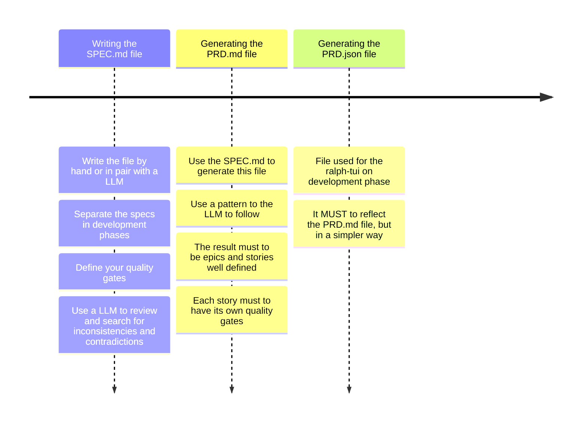
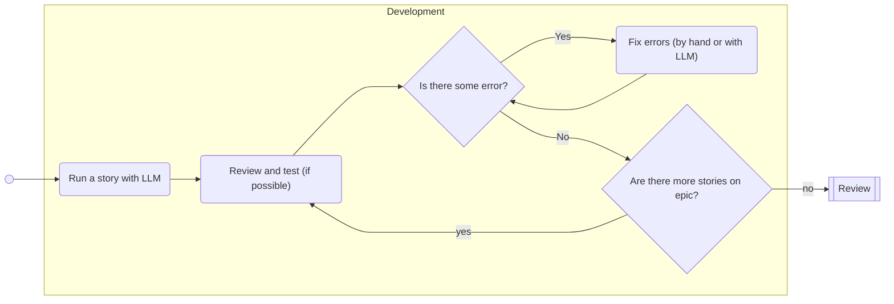
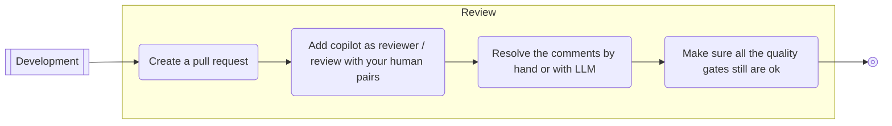

# Light SDD Workflow

## Main phases

### SPEC Phase (AKA upstream)
This phase reflects the upstream phase on an agile flow. It will start with your specifications and will to finish with epics and stories ready to run. Use a small LLM good to process and organize text.

#### Writing the SPEC.md file
Define the business rules and architecture here, never delegate these decisions to the LLM. If you need to do a pair with it, review EVERYTHING.

These definitions doesn't need to be long or complex, but it need to describe the system. Consider to use mermaid notation diagrams to give more details to the LLM on the next steps (specially about the business core).

You can use flowcharts for complex chunks of logic, sequence diagrams for complex communications, timeline diagrams for rules that must happen in a specific order or state machine diagrams if your system has that type of complexity.

> Separating the specs as epics in development phases will make things easer on the later steps.

> Define all your quality gates here.

> Consider to use a LLM to review and check for inconsistencies and contradictions on your specs.

#### Generating the PRD.md file
Use the previous written SPECS to generate this file. Indicate a pattern to the LLM to follow. I use the ralph-tui pattern, for example, but you can use any you prefer. More of it on later sessions.

This file must to have all the given specs separated in epics and user stories. If you separated your specs in development phases, this should be reflected here. The user stories must to be small and easy to review. Each story must to have its own quality gates.

> Prefer to have a archirecture story at the end of every epic, for updating your README and ARCHITECTURE files.

> Review the file and agree with it before the next step.

#### Generating the PRD.json file
This is the json file actually readen by the ralph-tui application. It should have all the epics and stories defined in a simple way, with all steps to take and quality gates. It MUST to reflect the PRD.md file.

> Review the file and agree with it before the next step.

### Development phase (AKA downstream)

#### Developement

This is the moment where you assist the LLM to run all the plan prepared on SPEC phase. If you are using the ralph-tui application, you can run the commnad `ralph-tui run --prd prd.json` for starting the ui.

You can run all the stories automatically and test only in the end, but this has a potential to take more time than save it. Just prefer to run one small story by time and review / test when possible.

Create a script that runs build/lint/security/scan/automated tests at once. Then, you will need to run only one command to test the project integrity after running a story. If possible, test manually too. **Be sure your product works**.

If some fix be necessary, you can fixit or ask a LLM to fix for you. Again, small LLMs are doing a great job on this minor fixes and refactor to me.

Repeat this proccess until all stories be finished.

#### Review

There's no much to say about the review phase. Just create your pull request as you always done. But, if you use github, you can ask copilot to review the code for you. Ask your pairs to review it too, **humans are not obsolete**.

If copilot return something relevant, you can solve it or ask a small LLM to solve for you. Again, be sure about your project integrity, run all your checks after each change and test manually if possible.

Now your ready to restart the cycle on the next epic.

## Epic cycles

## Notes
### What is ralph loop and the ralph-tui and why use it

### The importance of automated tests and security scans

### Green fields vs brown fields

### The importance of README and ARCHITECTURE files on Ai written projects

## Resources
