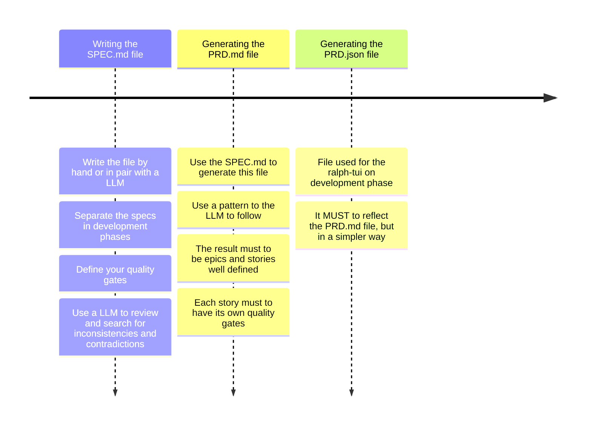
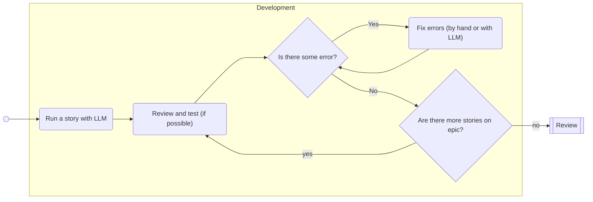
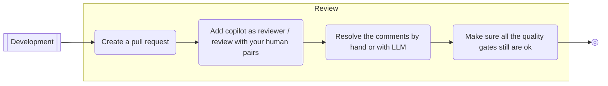
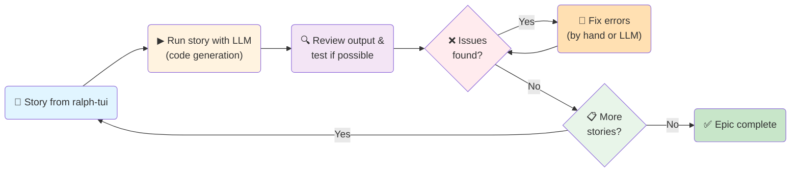

# Light SDD Workflow

## Main phases
### SPEC Phase (AKA upstream)
This phase reflects the upstream phase on an agile flow. It will start with your specifications and will finish with epics and stories ready to run. Use a small LLM optimized for text processing and organization, but **keep humans in control of all business logic and architecture decisions**. The SPEC phase is where you capture what the system *must* do and *why*, establishing the foundation for all downstream work.

#### Writing the SPEC.md file

Your SPEC.md file is the **contract between stakeholders and your development team**. It defines business rules, system architecture, quality gates, and constraints—the critical decisions that humans must own and verify, never delegate entirely to LLMs. Think of it as a conversation with your team that answers: "What problem are we solving? What are the system's boundaries? What must never break?"

A good specification is **complete, consistent, unambiguous, and verifiable**. Write requirements using imperative language ("the system **shall** process payments within 5 seconds") rather than soft language ("the system should be fast"). Avoid superlatives, subjective phrases, or vague terms like "user-friendly" or "as needed"—these invite interpretation and later disputes about whether requirements are met. Instead, be measurable: "display results in under 2 seconds" vs "display results quickly."

Structure your SPEC.md with sections for:
- **Purpose & Overview** — What problem does this system solve? Who uses it?
- **Business Rules** — Policies, constraints, workflows that govern behavior (especially important for LLMs to understand later)
- **System Architecture** — High-level design, key components, data flow (use mermaid diagrams for flowcharts, sequence diagrams, state machines for complex logic)
- **Quality Gates** — What does "done" mean? Define acceptance criteria, performance targets, security requirements, testing approach *upfront*
- **Assumptions & Constraints** — What are we NOT building? What dependencies exist?

Use diagrams liberally. Flowcharts clarify complex business logic, sequence diagrams show interactions between components, state machines capture transitions (e.g., order states: pending → confirmed → shipped → delivered). These visual specifications are invaluable for LLMs—they provide concrete examples of what "correct" behavior looks like.

**Separate your specs by development phases/epics early**. If you're building an e-commerce system, grouping specs as "Auth & User Management," "Product Catalog," "Shopping Cart," "Payments" makes the downstream task easier. When you generate the PRD later, this separation naturally becomes your epic structure.

**Use an LLM to review your specs for inconsistencies, contradictions, and missing requirements**. Feed the LLM your draft SPEC.md and ask: "Are there any contradictions in these business rules? Any requirements that conflict with each other? What's missing?" This catches ambiguities before they become expensive bugs.

#### Generating the PRD.md file

Once your SPEC.md is solid, use it to generate a detailed PRD (Product Requirements Document). Provide the LLM with a template or pattern to follow—structure, format, and level of detail. The Light SDD workflow works well with a pattern that organizes stories into epics, with each story including description, acceptance criteria, and quality gates.

Your PRD.md must reflect your SPEC.md exactly—if your SPEC defines "payment processing must complete in under 5 seconds," that requirement appears in the PRD either as an acceptance criterion for a story or as a non-functional requirement across the epic. This traceability ensures nothing gets lost between phases.

Keep stories small and independently verifiable. A good user story is something one developer can complete and test in a few hours to a day. Large stories hide complexity and delays feedback. Each story must have clear acceptance criteria—concrete, testable conditions that define "done" (e.g., "Given a user in the cart, when they click Checkout, then the payment page loads with order details pre-filled and a payment form").

**Include an architecture story at the end of each epic**, dedicated solely to updating README and ARCHITECTURE files with what you've learned. After implementing an auth epic, for example, document the authentication patterns, data structures, and decision rationale so future developers and LLMs understand your approach.

Review the PRD.md with your team before moving to the next phase. Get alignment on scope, priorities, and acceptance criteria. This review is your last chance to catch misunderstandings cheaply—once development starts, changes become expensive.

#### Generating the PRD.json file

The PRD.json file is the execution format for ralph-tui. It distills your PRD.md into a simpler structure: epics, stories, steps, and quality gates. The JSON must accurately reflect the PRD.md — if a detail appears in the PRD but not in the JSON, developers might miss it. Think of it as the "runbook" version of the PRD: clear, structured, and directly executable.

Each story in the JSON should include: title, description, acceptance criteria, steps to implement (if known), quality gates to validate, and any dependencies on other stories. Ralph-tui reads this file and presents stories one at a time, tracking progress and ensuring nothing is skipped.

Review the PRD.json against the PRD.md side-by-side. Verify every requirement from the PRD appears somewhere in the JSON. Check for consistency—if two stories mention the same business rule, confirm they align. Once you've agreed on the JSON, it becomes the source of truth for development.

### Development phase (AKA downstream)
#### Development

The Development phase is where you execute the plan prepared in the SPEC phase. This is the moment to bring your PRD.json stories to life with autonomous agent assistance, guided by the ralph loop principle: **run small, test immediately, fix fresh, then move forward**. If you're using ralph-tui, invoke it with `ralph-tui run --prd prd.json` to start the autonomous orchestration loop. **Important**: Start execution with the `s` command, then press `p` to set the agent to pause after each story completes (**this must be done while the story is running**) — this allows you to review outputs, run quality gates, test manually, and make decisions before moving to the next task. Ralph-tui orchestrates a continuous four-step execution cycle automatically: **(1) SELECT** the next task based on dependencies and priority, **(2) PROMPT** the agent with context from your prd.json and ARCHITECTURE file, **(3) EXECUTE** the agent to generate code and changes, and **(4) EVALUATE** the output to determine if the story is complete or needs fixes. The terminal TUI dashboard monitors this autonomous execution in real time. Press `r` to resume after reviewing and validating outputs. Your role is to validate autonomous outputs, ensure quality gates pass, and make critical decisions about fixes or alternative approaches.

**Story Execution Pattern**: Ralph-tui's autonomous execution depends on the quality of your prd.json and ARCHITECTURE file. Each story in prd.json should include a clear description, acceptance criteria, relevant dependencies, and contextual hints about architectural decisions. Ralph-tui uses this structure to automatically generate prompts for the agent during the PROMPT step [phase 2], injecting your ARCHITECTURE file and relevant context snippets to ground the agent in your system's patterns and conventions. This upfront preparation—detailed prd.json and well-maintained ARCHITECTURE—replaces the need for conversational back-and-forth with the agent. You don't ask the agent "implement registration"; instead, your prd.json story already defines "User Registration with Email Validation" with clear acceptance criteria, edge cases, and dependencies. Ralph-tui then presents these to the agent as part of the autonomous PROMPT step. After ralph-tui's EXECUTE phase produces code, your job begins: review the output against your documented architecture patterns, validate code quality and integrability, and run your automated quality gates. This context-rich preparation produces code that's coherent with your system, not just technically correct but architecturally sound.

**Test-First Principle in Practice**: Ralph-tui's autonomous EXECUTE phase generates code, but validation is your responsibility. After execution completes [EVALUATE phase], immediately run your automated quality gate script (`mocha test/**/*.js && njsscan --output json .` or equivalent). Don't wait until the end of the epic. Why? Because bugs caught immediately are cheap to fix—the context is fresh, the code is simple, and you understand both the issue and its resolution. This incremental testing prevents the dreaded "integration week" where dozens of tests fail simultaneously and no one remembers why code was written that way. If tests fail or security scans flag issues, you have three options: (1) Fix directly if it's a minor issue, (2) Revise your prd.json story definition and re-run ralph-tui on that task (the agent may need clearer constraints or better context), or (3) Pause ralph-tui, escalate to manual intervention, then resume. Never skip quality gate checks in hopes of fixing later—the immediate feedback loop is what makes ralph-tui effective.

**Common Pitfalls to Avoid**: Stories that are too large hide complexity. A story that should take 8 hours but actually takes 3 days suggests it should have been split. Keep stories small—aim for ones that complete in a few hours to a day. Another pitfall: accepting generated code without review. Just because an LLM produces working code doesn't mean it's maintainable, secure, or consistent with your architecture. Always review the output yourself (or with teammates), verify that edge cases are handled, and ensure it follows your naming conventions and error-handling patterns. A third pitfall: skipping manual testing because automated tests pass. Automated tests validate that the code does what you told it to do; they don't validate that what you told it to do actually solves the user's problem. Spend 5 minutes manually testing the feature—does it behave intuitively? Does it handle unexpected inputs gracefully?

**Practical Example**: Suppose your first story in the Authentication epic is "User Registration with Email Validation." Your prd.json entry for this story should specify: acceptance criteria ("Given a user on the signup form, when they enter an email and password, then they receive a confirmation email and can log in after confirming the email"), context hints ("use the ARCHITECTURE's documented password hashing approach and email service patterns"), and edge cases to handle ("invalid email format, duplicate email, email service timeout"). When ralph-tui reaches this story in the SELECT phase, it generates a prompt injecting your ARCHITECTURE file with these constraints. The agent executes the implementation. Your job: run your quality gate script (`mocha test/**/*.js && njsscan --output json .`). If tests pass and security scan is clean, manually test the signup flow—verify the confirmation email arrives, verify login fails before email confirmation, verify the password is hashed. If everything works, ralph-tui continues to the next story. If tests fail or quality gates don't pass, either fix the issue directly (for minor bugs), revise your prd.json story definition for clarity, or pause ralph-tui and manually intervene. Then resume the loop.

**Handling Blockers and Dependencies**: When a story can't proceed because it depends on incomplete work from another story, track it in ralph-tui as "blocked." Don't skip it hoping to come back later—instead, note the dependency explicitly and move to an unblocked story. Some stories may expose issues the LLM struggles with: complex business logic, integration with external systems, or architectural decisions. In these cases, stop generating code and think: Is the story too large? Does the SPEC.md explain the business rule clearly enough? Does the LLM have enough context about your codebase? Go back to the ARCHITECTURE file or SPEC.md, either expand the context or split the story further, then try again. The LLM is a tool to accelerate writing code, not to replace thinking about design—when stuck, that's often a signal that the work needs rethinking before implementation.

#### Review

The Review phase is your final quality checkpoint before merging an epic into the main branch. This phase combines automated verification with human judgment—honoring that **humans are not obsolete** in AI-assisted development. The goal is not to catch every possible issue, but to verify that code meets your quality gates, respects architectural patterns, and solves the stated problem without introducing regressions.

**Code Review Strategy**: When you finish all stories in an epic, create a pull request. Your PR should include: a clear description of what changed, which epic and stories it delivers, and a summary of any architectural decisions made during development. Your review checklist should verify: **(1) Architecture compliance** — does the code follow your established patterns, naming conventions, and data-flow designs documented in ARCHITECTURE? **(2) Test coverage** — are acceptance criteria validated by tests? Are edge cases covered? **(3) Security** — did your automated security scan pass? Does the code avoid common vulnerabilities like SQL injection, hardcoded secrets, or unsafe dependencies? **(4) Quality gates** — do all automated checks pass (build, lint, tests, security scan)? **(5) Documentation** — is the ARCHITECTURE file updated with new patterns or decisions discovered during this epic?

**Human vs. AI Role in Review**: Use GitHub Copilot (or a similar LLM reviewer) to check for syntax errors, missing imports, and code style violations—these are mechanical checks that computers do well. But reserve human review for decisions: Does the error-handling strategy make sense for this context? Is the business logic correct? Does the code align with your vision for the system? A human reviewer, familiar with your domain and architecture, catches semantic issues that no automated tool will find. If Copilot or another LLM reviewer flags something relevant—a potential null pointer, an inefficient loop, a missing validation—examine it carefully. If it's a real issue, either fix it yourself or ask a small LLM to refactor that specific function, then re-run your test script to confirm the fix.

**Quality Gate Re-verification**: After addressing code review comments and making changes, **re-run your full quality gate script** before merging. Changes made in review might introduce new test failures or security issues. A comment fix might accidentally skip validation; a refactoring might break an integration point elsewhere. This is especially important in AI-assisted projects where rapid iteration can introduce subtle bugs. Run the build, tests, security scan, and lint checks again. If everything passes, you can confidently merge. If something fails, address it immediately—don't defer quality gate failures to the next epic.

**Comment Resolution Workflow**: Review comments fall into three categories: **(1) Must fix** — issues that violate your quality gates or security policy (failed test, security vulnerability, architectural violation). These require fixes before merge; address them directly or ask the LLM for specific fixes, re-verify with tests. **(2) Should fix** — improvements that enhance maintainability or alignment with your patterns (refactoring for clarity, adopting a better error-handling approach, documenting a complex section). Prioritize these but don't block merge if they're minor. **(3) Consider for next epic** — suggestions for future work ("this feature would benefit from caching" or "we should extract this logic to a utility"). Track these separately for your Product Backlog; don't let review comments expand scope beyond the current epic.

**Merge Checklist**: Before clicking "Merge," verify: ✓ All automated checks (CI/CD pipeline) are passing. ✓ Tests are green (unit, integration, security scans). ✓ Code review comments are resolved or tracked for future work. ✓ ARCHITECTURE file is updated with patterns discovered during this epic. ✓ Manual testing was performed on critical user flows. ✓ No quality gates were violated. Once merged, your epic is complete and deployed (or ready for deployment, depending on your release process). Now you're ready to restart the cycle with the next epic—whether that's continuing in an AllIn workflow with the next epic you previously specified, or cycling back to SPEC phase in an AgileSDD workflow to write specifications for the next epic.

## Epic workflows

### AllIn Workflow
This workflow is ideal when you have a clear vision of the entire system from the start. You begin by writing the specifications for all your epics at once (`specPhaseComplete`, step 1). Then, for each epic, you create a separate branch and develop it independently (`oneEpicByTime`, step 2). Within each epic, you work through the stories one by one (`oneStoryByTime`, step 3), iterating on them until the epic is complete. After finishing an epic, you move on to the next, repeating the process. This approach is structured and works well for greenfield projects or when requirements are stable and well-understood.

### AgileSdd Workflow
This workflow is more incremental and adaptive, suitable for projects where requirements may evolve or are not fully known upfront. Here, you write the specification for one epic at a time (`specPhaseOnyEpicByTime`, step 1). You then develop that epic (`developEpic`, step 2), working through its stories individually (`developStory`, step 3). After completing a story, you can either continue with the next story or revisit the epic for adjustments. Once the epic is done, you return to the specification phase for the next epic. This cycle allows for continuous feedback and adaptation, making it ideal for agile teams and projects with changing needs.

## Notes
### What is ralph loop and the ralph-tui and why use it
The **ralph-tui** is an autonomous agent loop orchestrator designed for the Development phase of the Light SDD Workflow. It reads your `prd.json` file (the JSON representation of your Product Requirements Document) and implements a continuous **four-step execution cycle**:

1. **SELECT** — ralph-tui reads your prd.json, picks the next task based on priority and dependencies (skipping blocked or completed stories)
2. **PROMPT** — generates an optimized prompt from your prd.json story definition, injecting your ARCHITECTURE file and relevant code context
3. **EXECUTE** — runs an autonomous AI agent (Claude, OpenCode, etc.) to implement the story based on the generated prompt
4. **EVALUATE** — analyzes the agent's output to determine if the story is complete, needs revision, or has blockers

You invoke this loop with `ralph-tui run --prd prd.json`. The **ralph loop** is this orchestration cycle—ralph-tui runs it autonomously on your prd.json until complete. You don't manually step through stories; the loop does. You can pause at any time to review work, run quality gates, test manually, or address blockers, then resume seamlessly using session persistence. This tool is what makes the Development phase practical—it eliminates manual bookkeeping of which stories are done, in-progress, or blocked, and automates story selection based on your dependency graph.

Why this matters: Rather than humans running all stories at once and testing at the end (discovering dozens of bugs simultaneously), ralph-tui iterates incrementally—each story executes autonomously, and you immediately validate the output. This short feedback loop catches semantic conflicts and integration issues early when context is fresh, prevents the 'integration week' catastrophe, keeps the codebase in a testable state throughout development, and maintains confidence in code quality. The agent handles code generation; humans handle decision-making and validation.

### The importance of automated tests and security scans
Automated tests and security scans are the foundation of maintaining quality gates throughout the Light SDD Workflow. Every story completion should trigger a consistent, automated verification: **does the code build? Do tests pass? Are there security vulnerabilities?** This prevents the workflow's biggest risk: shipping broken or insecure code because defects weren't caught early.

In Light SDD, create a single script (e.g., `test.sh` or equivalent) that chains together: linting, build compilation, unit tests, integration tests, and security scanning. You can use libs/applications like `mocha` for testing and `opensecurity/njsscan` for SAST (Static Application Security Testing), so your script might run `mocha test/**/*.js` followed by `njsscan --output json .` to catch logic errors and security flaws in one pass. After completing each story with the ralph loop, is a good practice to run this single command once—if it passes, you know the story is solid (and never forget about the linter and its importance to maintain a pattern in the written code); if it fails, you fix it immediately with fresh context. This is far more efficient than discovering dozens of test failures after all stories complete.

The specific types of checks matter: **unit tests** verify individual functions work correctly, **integration tests** confirm different components work together, and **security scans** detect patterns like hardcoded secrets, injection vulnerabilities, or dependency risks before code reaches production. By placing these in an automated script run after each story, you align your development practice with the workflow's core principle—continuous verification and early error detection. Documentation of your automated test approach should be in your ARCHITECTURE file so future developers understand the testing strategy.

### Green fields vs brown fields
**Greenfield** development means building a new system from scratch—you have no existing codebase to work with, requirements are typically well-defined upfront, and you can architect systems optimally from the beginning. Greenfield projects are ideal for the **AllIn workflow** in Light SDD: write specifications for all epics first, then develop them in sequence. There are no legacy constraints, no existing code to understand, and no integration points with mature systems. Examples: building a new microservice, a new product line, or a complete rewrite of a system.

**Brownfield** development means working within an existing system—you inherit legacy code, architectural decisions you didn't make, and constraints from production systems. Brownfield projects benefit from the **AgileSDD workflow**: write specifications one epic at a time, develop and deliver each epic, then repeat. Why? Because existing systems often have hidden requirements that only surface once you start working in them. By cycling through spec → development → delivery one epic at a time, you discover these constraints early and adapt your approach incrementally rather than midway through a months-long development cycle. Examples: adding features to a mature application, maintaining legacy systems, or integrating with existing infrastructure.

The Light SDD Workflow structure (with AllIn and AgileSDD variants) explicitly acknowledges this distinction because greenfield and brownfield have fundamentally different risk profiles. Greenfield risk is *completeness and architectural correctness*—did you design the system right? Brownfield risk is *integration safety and unforeseen constraints*—does your new code break existing functionality? By choosing the workflow that matches your context, you address the right risks at the right time.

### The importance of README and ARCHITECTURE files on AI written projects
When using AI assistance in development, documentation becomes your **bridge of understanding**—both for the LLM and for future developers. A README that explains "what this system does and why" and an ARCHITECTURE file that captures "how it's built and why we chose this design" are not optional polish; they're essential inputs for effective AI collaboration.

LLMs work best with clear context. When you ask an LLM to implement a story, it needs to understand your system's design patterns, business rules, and data flow. Without this, LLMs generate code that might work technically but violates your system's conventions, duplicates logic, or creates hidden bugs. A well-maintained ARCHITECTURE file describing your core patterns, data structures, and key decisions provides the grounding LLMs need to generate coherent, consistent code. Your Light SDD workflow's emphasis on including an **"architecture story" at the end of each epic**—dedicated to updating README and ARCHITECTURE files—reflects this necessity: after each epic, you capture what you've learned about the system's design, making that knowledge available for the next epic's LLM assistance.

Documentation also protects you from vendor lock-in or LLM dependency. Six months from now, if you need to refactor or extend code, a well-documented ARCHITECTURE file lets you (or another developer) understand intent without reconstructing it from code alone. For AI-written projects especially, this documentation is your insurance: it ensures knowledge survives beyond the LLM session and remains accessible to humans.

## Resources

### SPEC Phase
- [Wikipedia - Software Requirements Specification](https://en.wikipedia.org/wiki/Software_requirements_specification) — Comprehensive overview of SRS standards, structure, requirement quality characteristics, and IEEE/ISO standards (IEEE 830, ISO/IEC/IEEE 29148)
- [TechWhirl - Writing Software Requirements Specifications](https://techwhirl.com/writing-software-requirements-specifications/) — Practical guide on SRS templates, requirement quality indicators, avoiding ambiguous language, establishing traceability matrices, and best practices for writing unambiguous requirements

### Development Phase & Ralph Loop
- [Ralph TUI - AI Agent Loop Orchestrator](https://ralph-tui.com) — Comprehensive documentation on autonomous agent orchestration, four-step execution cycle (SELECT/PROMPT/EXECUTE/EVALUATE), task routing, session persistence, and TUI dashboard monitoring. Essential reference for understanding ralph-tui operations and command interface.
- [Martin Fowler - Patterns for Managing Source Code Branches](https://martinfowler.com/articles/branching-patterns.html) — Understanding greenfield vs brownfield development contexts, branching strategies for sustainable development, and integration frequency patterns
- [Martin Fowler - Continuous Integration](https://martinfowler.com/articles/continuousIntegration.html) — High-frequency integration practices, testing strategies, and maintaining code quality through automation—directly aligned with the ralph loop approach

### Notes (Quality Gates & Testing)
- [Ralph TUI - AI Agent Loop Orchestrator](https://ralph-tui.com) — Comprehensive documentation on autonomous agent orchestration, four-step execution cycle (SELECT/PROMPT/EXECUTE/EVALUATE), task routing, session persistence, and TUI dashboard monitoring. Essential reference for understanding ralph-tui operations and command interface.
- [Mocha Testing Framework](https://mochajs.org/) — JavaScript test framework for unit and integration testing, used in this project for story validation
- [NJSScan by OpenSecurity](https://github.com/ajinabraham/njsscan) — Static security scanner for Node.js applications, detects vulnerabilities and code quality issues as part of automated quality gates
- [Continuous Integration Best Practices](https://martinfowler.com/articles/continuousIntegration.html) — Testing, automation, and high-frequency integration fundamentals that support the ralph loop and quality gates
